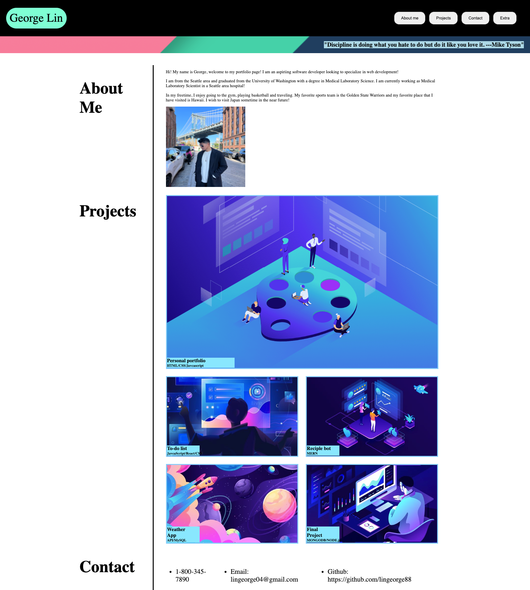

# Personal Portfolio Website

This is a personal portfolio website created using HTML and CSS to showcase the author's various projects to potential employers.

## Description

This website was created using modern HTML and CSS codes including the use of Flexbox and Media query to create a responsive design on various screen sizes.  This website was created for personal use only.



## Getting Started

### Dependencies

* A functional computer or movile device that has a web browser that supports HTML5 (ex. Google Chrome, Mozilla Firefox, etc.)

### Installing
No additional installation is required if a modern web browser is already installed. 

### Executing program

* Open the website at the following URL: https://lingeorge88.github.io/Personal-Portfolio-Website/
```
code blocks for commands
```

## Help

N/A

## Authors

George Lin

E-mail: lingeorge04@gmail.com
Github: https://github.com/lingeorge88

## Version History

* 0.1
    * Initial Release - created responsive structure and content of the webpage with placeholder images and links to various future projects

## License

N/A

## Acknowledgments
Placeholder images taken from: (https://www.pinterest.com/pin/8233211805106354/)
